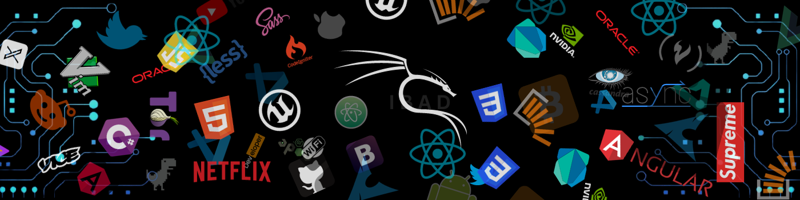

<h1 align="center">Hi 👋, I'm Ibad Khan</h1>
<h3 align="center">A passionate frontend developer from Pakistan</h3>

   
 
 

- 🔭 I’m currently working on  [My Portfolio ](https://aboutibadd.web.app/)

- 🌱 I’m currently learning **React JS**

- 👨‍💻 All of my projects are available at [My Website ](https://aboutibadd.web.app/)

- 💬 Ask me about **HTML , CSS , JavaScript ES6 **

- 📫 How to reach me **ibadurrehman718@gmail.com**

- ⚡ Fun fact **I am a somniloquist**

<h3 align="left">Connect with me:</h3>

<h3 align="left">Languages and Tools:</h3>

         

<h3 align="left"> Plans of Learning :</h3>

	

